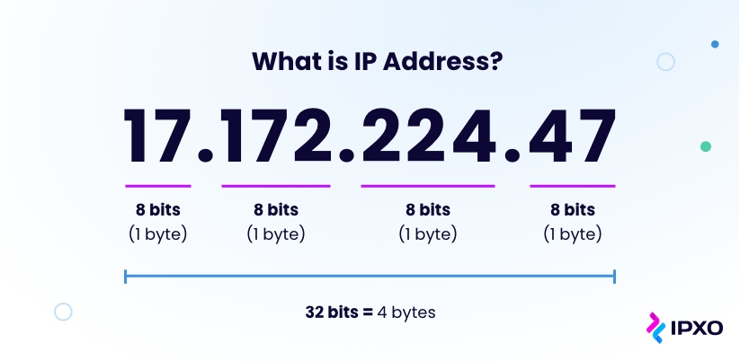
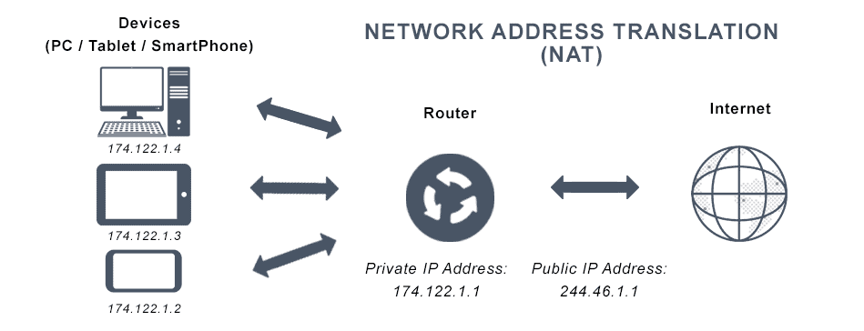
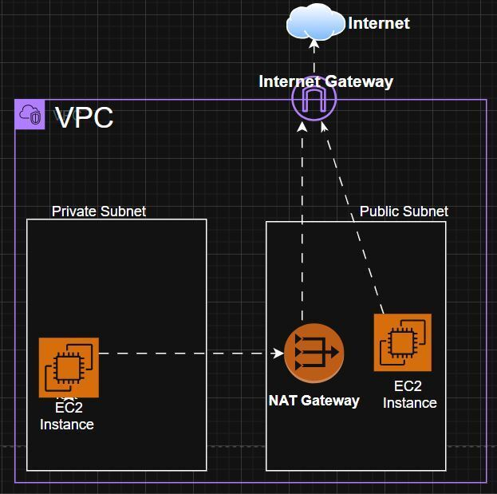
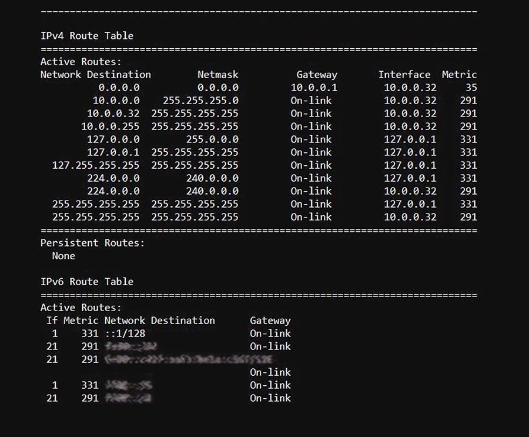
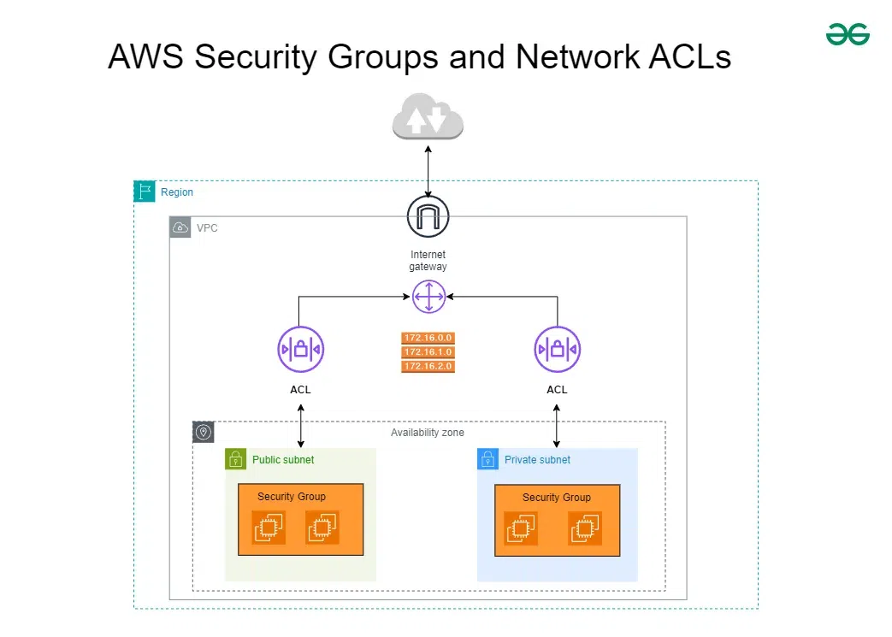
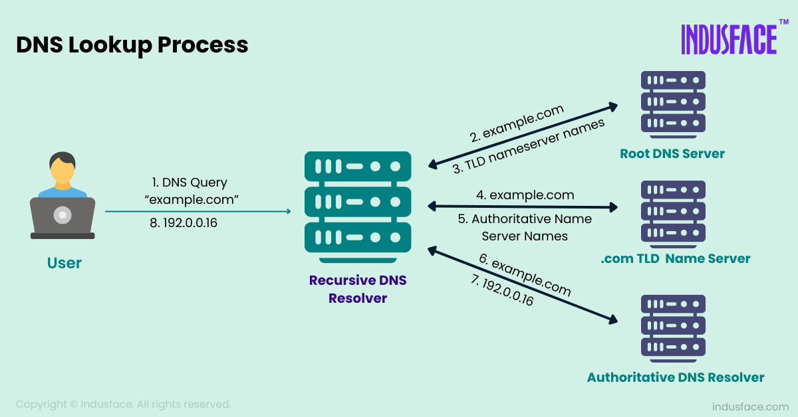

# Virtual Private Clouds (VPCs)
Isolated, private section of a public cloud, allowing for greater control. VPCs provide:
- **IP Address space** (private network range)
- **Subnets** (smaller networks inside the VPC)
- **Routing** (route tables decide how traffic flows)
- **Security** (firewalls, SGs, NACLs)
- **Gateways** (internet + NAT (Network Address Translation) gateways, VPN...)


**VPCs are IaaS.**


## Classless Inter-Domain Routing (CIDR)
Describes a range of available IP Adresses, with given wideness. 

CIDR blocks are denoted by **IP/length**, e.g.
- 10.0.0.0 **/16**
- The **/number** can be up to **-8, -16, -24, -32**
    - This indicates **how many bits are fixed**
- e.g. 10.0.0.0/16 = **65,536 private IPs**
    - from 10.0.0.0 to 10.0.255.255


- **/8** = ~16mil IPs
- **/16** = 65,536
- **/20** =  4,096
- **/24** = 256
- **/32** = 1

The CIDR block defines the size of the VPC's IP address space.
- e.g. **VPC CIDR**: 10.0.0.0/16

Then, **divided into subnets**:
- **Subnet A**: 10.0.1.0/24
- **Subnet B**: 10.0.2.0/24
- **Subnet C**: 10.0.3.0/24

The VPC's CIDR block must be the **widest**, so the CIDR blocks of **its subnets can be within it**. The VPC CIDR must be large enough for subnets across AZs, instances, databases...

**Two peered (network connected) VPCs cannot overlap IP ranges**


## IP Addresses
Unique identifiers for each device on a network. 

**IPv4** (numeric dot notation)
- 4 Numbers (0-255), representing 32bits
- 4.3bil unique addresses
- e.g. 192.168.0.1



**IPv6** (alphanumeric hexadecimal notation)
- 128bit address
- 7.9x10^28 unique addresses (**effectively unlimited**)
- 50b2:6400:0000:0000:6c3a:b17d:0000:10a9


**Each IP address has two parts**:
- **Network portion** - which network the device belongs to
- **Host portion** - which specific device (host) in the network it is

**A subnetmask / CIDR determines how many bits belong to each part.**

**Reserved IP ranges**:
- Private use IP ranges:
    - 10.0.0.0/8
    - 172.16.0.0/12
    - 192.168.0.0/16
- Other reserved ranges:
    - 127.0.0.0/8 (loopback)
    - 169.254.0.0/16 (link-local)
    - 224.0.0.0/4 (multicast)
    - 240.0.0.0/4 (future use)
    - 100.64.0.0/10 (carrier-grade NAT)

**NATs** (Network Address Translation)   
A method used by routers to rewrite IP addresses on packets in transit.
- **Allows multiple devices on a private network to share a single public IP address to connect to the internet**
- This conserves public IPv4 addresses and provides a layer of security by **hiding the private IP addresses from the public network**




## Subnets
Takes a larger IP block and splits it into smaller blocks. For example:

VPC CIDR:
- 10.0.0.0/16 (65,536 IPs)

Subnets inside it:
- 10.0.1.0/24 (256 IPs)
- 10.0.2.0/24 (256 IPs)
- 10.0.3.0/24 (256 IPs)

Each subnet has:
- **Network address** (first IP; identifies the subnet)
- **Broadcast address** (last IP; broadcasts within subnet)
- **Usable IPs** (everything in between)

**Subnet Masks**   
Another way of describing how many bits are used for the network part. For example:

CIDR: 
- 192.168.1.0/24
    - CIDR prefixes:
        - /8 = huge; big orgs
        - /16 = VPCs
        - /24 = small subnets
        - /28 = tiny subnets
        - /32 = single address (host route)

Subnet mask:
- 255.255.255.0
    - 255 in binary = 11111111 (8) = network bits
    - 0 in binary = 00000000 (8) = host bits


**An IP address belongs to exactly one subnet**
- And, each subnet exists in one Availability Zone (AZ)

**A subnet groups multiple IP addresses**

**The CIDR describes which part of the IP is the network vs host portion**
- e.g. CIDR: 10.1.0.0/24
- An IP inside it: 10.1.0.37
    - Network part: 10.1.0
    - Host part: 37


## Gateways
A device or service that connects one network to another and manages how traffic flows between them.

A gateway may connect:
- Private network -> internet
- One VPC/subnet -> another VPC/subnet
- Data center -> a cloud VPC
- Local machine -> home network router

**Internet Gateway (IGW)**   
Connects a private network to the public internet.
- Allows outbound internet access (public IP)
- Allows inbound traffic (only to public IPs)
- Routing, not NAT
- **Doesn't hide private IPs** - expects public IPs

**NAT Gateway**   
Allows private resources to access the internet **without being exposed to it.**
- **Only allows outbound connections** (private -> internet)
- **Blocks inbound connections** from unknown sources
- **Translates** internet private IPs into one public IP
- Private instances remain unreachable from the public internet

NATs are charged per hour, while IGWs are free.

**Architecture**   
The most common architecture is **public + private subnet architecture**. 3-tier architecture for cloud environments:

```
VPC (10.0.0.0/16)
    -Public Subnet (10.0.1.0/24) -> IGW
        -Public web server, load balancers...
    -Private Subnet (10.0.2.0/24) -> NAT
        -Private EC2 instances, containers, app servers that call external APIs...
```



**Fully private architecture (no internet)** is completely private, with on-prem network only. This is for particularly sensitive workloads.

**Hybrid architecture** is on-prem + cloud:
- On-prem -> VPN -> Cloud VPC


## Route Tables
Tells the network where to send traffic. **Every subnet in a VPC must be associated with exactly one route table.**
- If destination IP matches X, send to Y

**Components of a route**:
- **Destination** - IP Range (CIDR)
- **Target** - Where to send traffic (IGW, NAT, local (inside VPC), VPN, instance...)



**0.0.0.0/0 means "internet"** (as opposed to local)

A subnet's route table decides which gateway different traffic uses.

Outbound private -> internet:
- Instance -> Subnet -> Route table -> NAT -> IGW -> Internet

Inbound internet -> public instance
- Instance -> IGW -> Route table -> Public subnet -> Instance (with public IP)


**Route table association** links a route table to a network entity (e.g. subnet, gateway...), directing network traffic for that entity based on the associated route table.


### Security Groups (SGs) and Network Access Control Lists (NACLs)
Security Groups (SGs) are **stateful, instance-level firewalls**. They control what traffic is allowed to reach/leave a specific resources, e.g. EC2 instances, load balancers, databases...
- **Stateful**: if inbound traffic is allowed, the response is automatically allowed outbound, even if the rules don't explicitly allow it. 
- SGs can **only allow** traffic, **not explicitly block it**.
- Typically based on the principle of **least privilege** with a layered defensive approach per instance, allowing only necessary traffic for function.


Network ACLs (NACLs) are **stateless, subnet-level firewalls**. They regulate traffic entering/exiting an **entire subnet**.
- **Stateless**: responses must be allowed separately
- NACLs can both **allow and deny**
- Rules are **evaluated in ascending order** until a match is found, **then evaluation stops**, so **rule order matters**
- Default NACLs allow all, while custom NACLs deny all by default...




### Domain Name System (DNS)
Translates human-readable domain names into computer-readable IP addresses. 
- Browser sends request to DNS server
- DNS server looks up corresponding IP address in database and sends it back
- Browser then connects to correct server to load the webpage.




### Route53
AWS' DNS and traffic-routing system. 
- Public DNS
- Private DNS inside a VPC
- Health check and failover routing
- Latency and geo-location based routing
- Alias records - AWS feature for use with load balancers, CloudFront...

Useful features:
- Fully integrates with VPCs
- Can host internal DNS zones
- Supports weighted, failover, and geo-location routing
- AWS-native alias records reduce complexity

